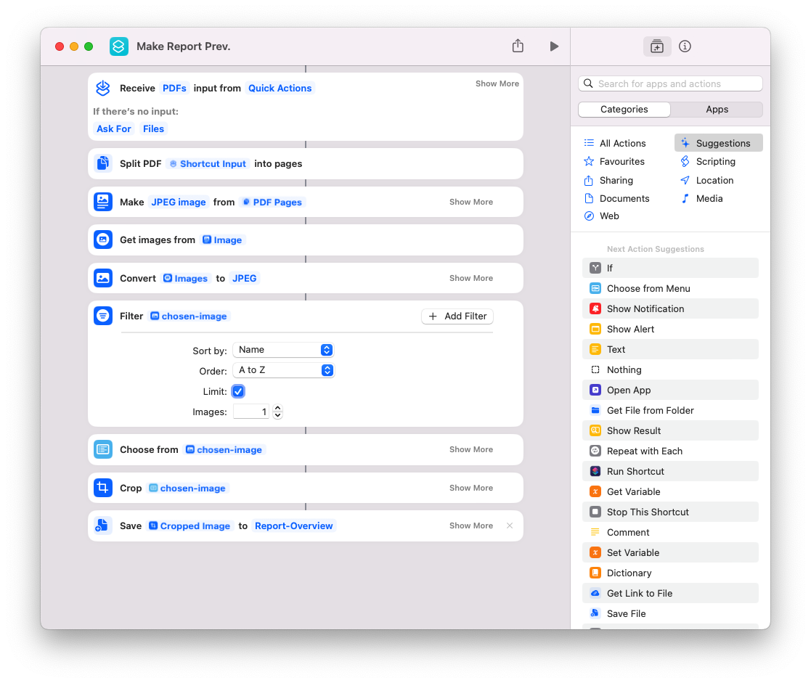

# PDF-extract-Overview
Script to extract an "Overview" image for email attachments. 

Project status: I can extract the Target page and crop it to the exact dimentions.

## The Problem to solve:
When sending website reports to clients, as an added feature we embed an "Overview" image inside the email, the overview contains a breakdown of the updates, security status, number of backups, uptime of the website and other information. 

When the feature was first added, I was cropping the .pdf file manually using Photoshop, uploading it to our website to generate a link, add that link to Trello and send the email, it was time consuming and inefficient. 

The first step into making the process more efficient was, when uploading the new "Overview" image to not change the link, meaning for each client we use the same image, with the same url and we just change the image. 

Another breakthrough was using Apple Shortcuts to crop the .pdf and save the image with a few clicks: 

https://www.icloud.com/shortcuts/2dc4829be41b4dd68b53049ed14f531a

## The "Why":

I want a program that will take as input the target .pdf file, and export the exact Overview image and upload it directly to the cloud, so a 1-click solution to the Problem. 

## The "How":

Using Python and PyPDF2 to extract the target .pdf page, pdf2image to convert the .pdf to .jpeg and find a way to upload it to the backend of my website. 
